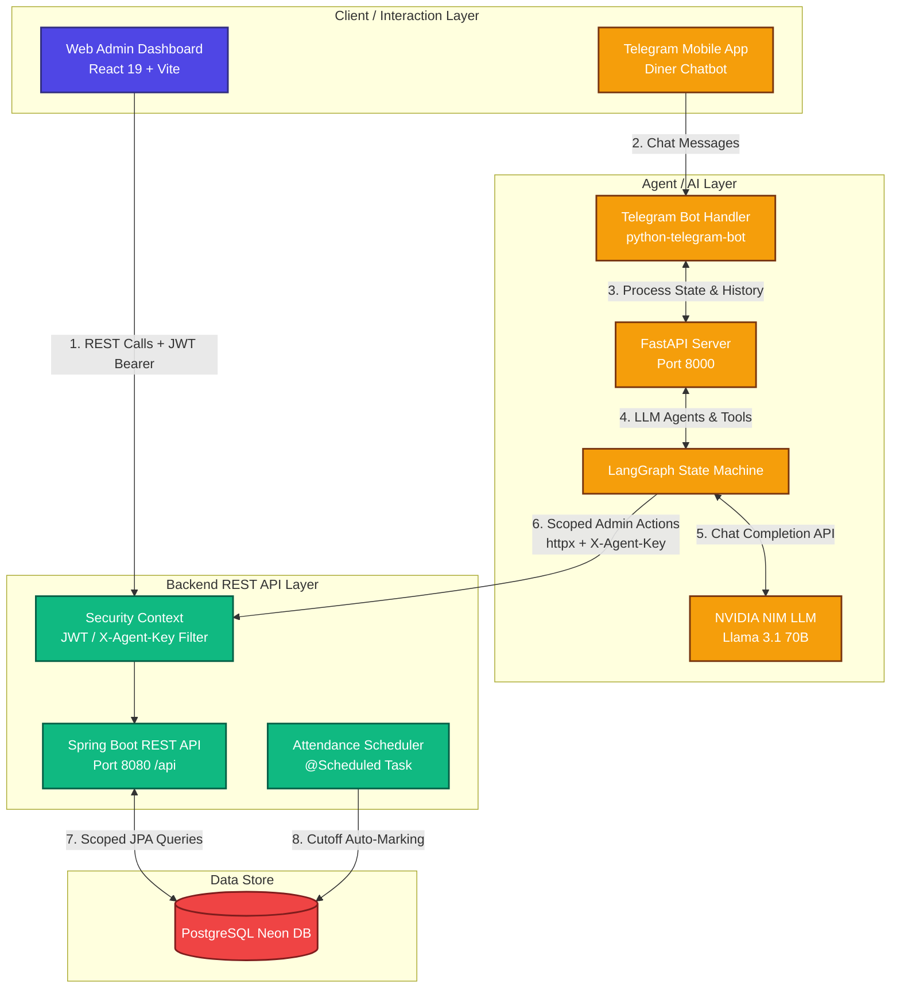
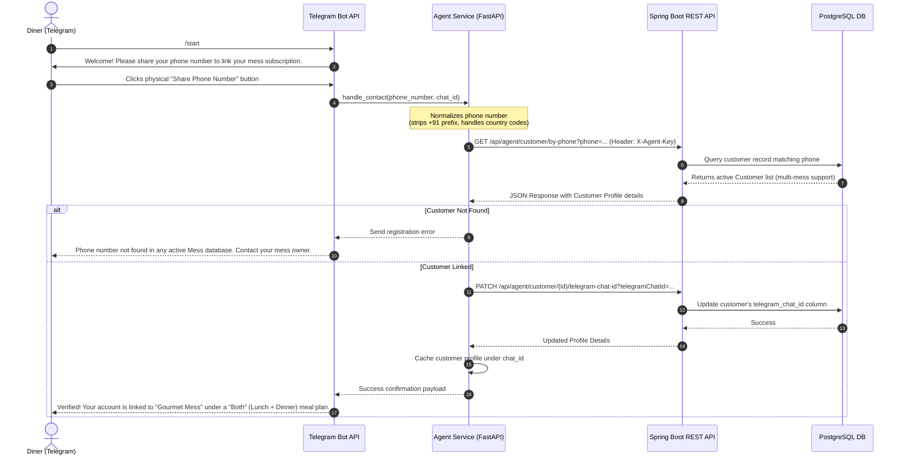
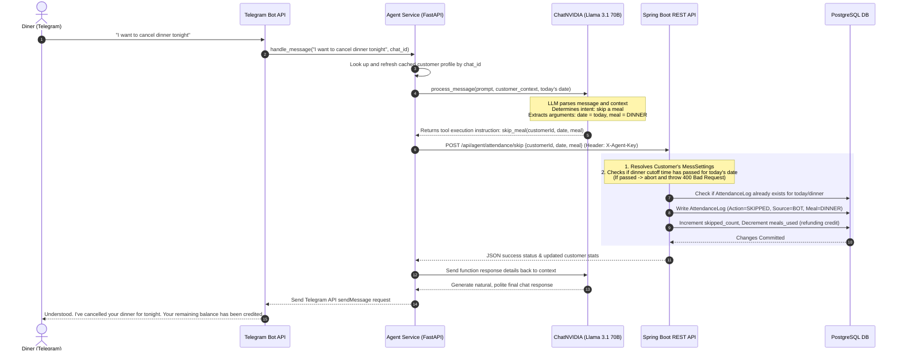
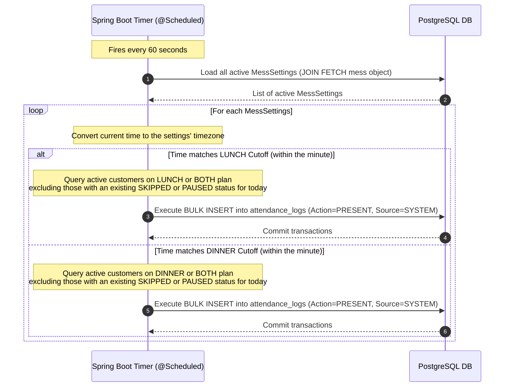
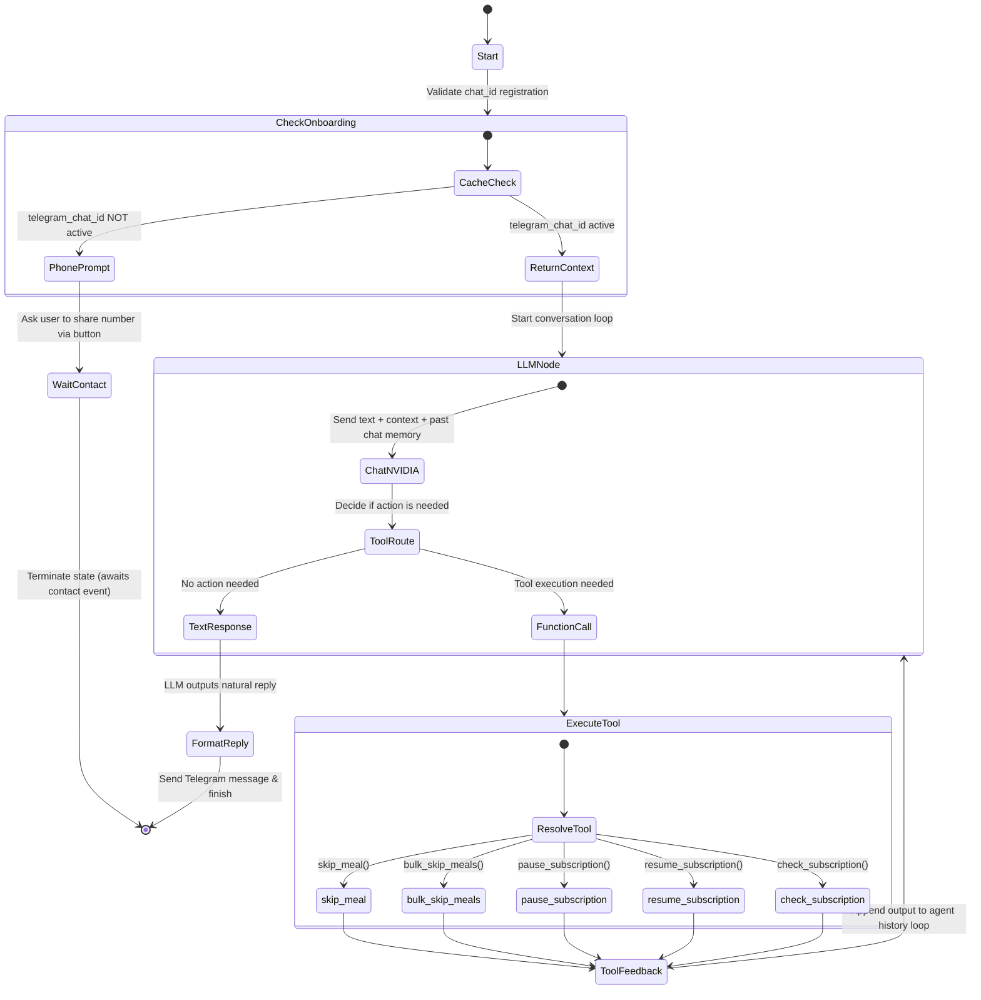

# 🏛️ MESS MANAGEMENT SYSTEM — SYSTEM ARCHITECTURE DOCUMENT

> **Document Type**: Comprehensive Architectural Blueprints & Data Model  
> **Target Audience**: Software Engineers, System Architects, and Maintainers  
> **System Version**: 2.0 (Fully Multi-Tenant)  
> **Last Updated**: May 30, 2026

---

## 1. HIGH-LEVEL COMPONENT ARCHITECTURE

The Mess Management System is a premium, secure, **multi-tenant SaaS platform** designed to streamline mess (canteen) operations for administrators and provide a seamless, AI-driven scheduling interface for diners (customers).

The system consists of three core components communicating over secure network protocols:
1. **Frontend Dashboard (`/frontend`)**: A React 19 + TypeScript + Vite web application styled with Tailwind CSS, used by mess owners (admins) to manage menus, view financial reports, audit attendance, and configure settings.
2. **Backend API Service (`/backend`)**: A Spring Boot 3.2.5 REST API running on Java 17, exposing data endpoints, enforcing security boundaries (JWT & API Keys), managing multi-tenant database partitions, and running cron-like scheduler tasks.
3. **AI Chatbot Agent (`/agent`)**: A Python FastAPI backend running a stateful **LangGraph** chatbot connected to Telegram and powered by the **NVIDIA NIM** platform (`meta/llama-3.1-70b-instruct`) for natural language scheduling.

### Component Relationship Diagram



---

## 2. DATABASE SCHEMA & ENTITY RELATIONSHIPS

The database is built on **PostgreSQL** and managed exclusively using **Flyway Migrations** (enforced using Hibernate `validate` strategy). Every primary key is a UUID generated on the database side using `gen_random_uuid()`. 

To prevent cross-tenant data leaks, all transactional tables feature a foreign key reference to `messes.id` (`mess_id`), creating logical partition structures.

### Entity-Relationship Diagram (ERD)

```mermaid
erDiagram
    MESSES {
        uuid id PK
        varchar name
        varchar location
        text address
        timestamp created_at
        timestamp updated_at
    }
    USERS {
        uuid id PK
        varchar username
        varchar email
        varchar password
        uuid mess_id FK
        timestamp created_at
        timestamp updated_at
    }
    USER_ROLES {
        uuid user_id PK_FK
        varchar role PK
    }
    CUSTOMERS {
        uuid id PK
        varchar name
        varchar plan "MealPlan: Lunch, Dinner, Both"
        varchar status "CustomerStatus: Active, Paused, Inactive"
        int meals_used
        int total_meals
        decimal amount_due
        date join_date
        int skipped_count
        varchar phone
        bigint telegram_chat_id
        uuid mess_id FK
        timestamp created_at
        timestamp updated_at
    }
    PAUSE_HISTORY {
        uuid id PK
        uuid customer_id FK
        date start_date
        date end_date
        timestamp created_at
    }
    ATTENDANCE_LOGS {
        uuid id PK
        date date
        uuid customer_id FK
        varchar customer_name
        varchar meal "MealPlan: Lunch, Dinner, Both"
        varchar action "ActionType: Skipped, Resumed, Paused, Present"
        varchar source "SourceType: Bot, Manual, System"
        uuid mess_id FK
        timestamp created_at
    }
    DAILY_MENU {
        uuid id PK
        date date
        text lunch_menu
        text dinner_menu
        uuid mess_id FK
        timestamp created_at
        timestamp updated_at
    }
    MESS_SETTINGS {
        uuid id PK
        time lunch_cutoff_time
        time dinner_cutoff_time
        boolean auto_mark_enabled
        varchar timezone
        uuid mess_id FK
        timestamp updated_at
    }

    MESSES ||--o{ USERS : "owns-accounts"
    MESSES ||--o{ CUSTOMERS : "manages-diners"
    MESSES ||--o{ ATTENDANCE_LOGS : "logs-activity"
    MESSES ||--o{ DAILY_MENU : "serves-menus"
    MESSES ||--|| MESS_SETTINGS : "configures"
    USERS ||--|{ USER_ROLES : "assigned"
    CUSTOMERS ||--o{ PAUSE_HISTORY : "tracks-pauses"
    CUSTOMERS ||--o{ ATTENDANCE_LOGS : "registers-activity"
```

### Table Definitions & SQL Schema

#### 2.1 `messes` (Tenant Table)
This is the root table. Every individual canteen or subscription unit registered on the platform is a tenant.
```sql
CREATE TABLE messes (
    id UUID PRIMARY KEY DEFAULT gen_random_uuid(),
    name VARCHAR(255) NOT NULL,
    location VARCHAR(255),
    address TEXT,
    created_at TIMESTAMP WITH TIME ZONE NOT NULL DEFAULT CURRENT_TIMESTAMP,
    updated_at TIMESTAMP WITH TIME ZONE NOT NULL DEFAULT CURRENT_TIMESTAMP
);
```

#### 2.2 `users` (Owner Accounts)
Holds credential data for mess administrators. Linked 1:1 or N:1 to a specific mess.
```sql
CREATE TABLE users (
    id UUID PRIMARY KEY DEFAULT gen_random_uuid(),
    username VARCHAR(100) UNIQUE NOT NULL,
    email VARCHAR(100) UNIQUE NOT NULL,
    password VARCHAR(255) NOT NULL,
    mess_id UUID NOT NULL REFERENCES messes(id),
    created_at TIMESTAMP WITH TIME ZONE NOT NULL DEFAULT CURRENT_TIMESTAMP,
    updated_at TIMESTAMP WITH TIME ZONE NOT NULL DEFAULT CURRENT_TIMESTAMP
);

CREATE TABLE user_roles (
    user_id UUID NOT NULL REFERENCES users(id) ON DELETE CASCADE,
    role VARCHAR(50) NOT NULL,
    PRIMARY KEY (user_id, role)
);
```

#### 2.3 `customers` (Diners / Subscriptions)
Represents diners subscribed to a mess. A customer with the same phone number can subscribe to different messes (e.g. multi-mess), which is why the uniqueness constraint is on `(mess_id, phone)`.
```sql
CREATE TABLE customers (
    id UUID PRIMARY KEY DEFAULT gen_random_uuid(),
    name VARCHAR(255) NOT NULL,
    plan VARCHAR(20) NOT NULL, -- Enum: 'LUNCH', 'DINNER', 'BOTH'
    status VARCHAR(20) NOT NULL, -- Enum: 'ACTIVE', 'PAUSED', 'INACTIVE'
    meals_used INT DEFAULT 0,
    total_meals INT NOT NULL,
    amount_due DECIMAL(10,2) DEFAULT 0.00,
    join_date DATE NOT NULL,
    skipped_count INT DEFAULT 0,
    phone VARCHAR(20) NOT NULL,
    telegram_chat_id BIGINT,
    mess_id UUID NOT NULL REFERENCES messes(id),
    created_at TIMESTAMP WITH TIME ZONE NOT NULL DEFAULT CURRENT_TIMESTAMP,
    updated_at TIMESTAMP WITH TIME ZONE NOT NULL DEFAULT CURRENT_TIMESTAMP,
    CONSTRAINT uk_mess_phone UNIQUE (mess_id, phone)
);
```

#### 2.4 `pause_history` (Diner Plan Pauses)
Maintains historical pause tracking. When a customer pauses their subscription, a row is added. The pause remains active until `end_date` is populated.
```sql
CREATE TABLE pause_history (
    id UUID PRIMARY KEY DEFAULT gen_random_uuid(),
    customer_id UUID NOT NULL REFERENCES customers(id) ON DELETE CASCADE,
    start_date DATE NOT NULL,
    end_date DATE, -- NULL indicates the pause is active indefinitely
    created_at TIMESTAMP WITH TIME ZONE NOT NULL DEFAULT CURRENT_TIMESTAMP
);
```

#### 2.5 `attendance_logs` (Daily Logs)
Every meal check-in, auto-marked attendance, skip request, or administrative modification records a row here.
```sql
CREATE TABLE attendance_logs (
    id UUID PRIMARY KEY DEFAULT gen_random_uuid(),
    date DATE NOT NULL,
    customer_id UUID NOT NULL REFERENCES customers(id) ON DELETE CASCADE,
    customer_name VARCHAR(255) NOT NULL,
    meal VARCHAR(20) NOT NULL, -- Enum: 'LUNCH', 'DINNER', 'BOTH'
    action VARCHAR(20) NOT NULL, -- Enum: 'PRESENT', 'SKIPPED', 'PAUSED', 'RESUMED'
    source VARCHAR(20) NOT NULL, -- Enum: 'BOT', 'MANUAL', 'SYSTEM'
    mess_id UUID NOT NULL REFERENCES messes(id),
    created_at TIMESTAMP WITH TIME ZONE NOT NULL DEFAULT CURRENT_TIMESTAMP
);
```

#### 2.6 `daily_menu` (Canteen Menu per Day)
Stores the daily menu for each mess. Scoped via unique constraint `(mess_id, date)`.
```sql
CREATE TABLE daily_menu (
    id UUID PRIMARY KEY DEFAULT gen_random_uuid(),
    date DATE NOT NULL,
    lunch_menu TEXT,
    dinner_menu TEXT,
    mess_id UUID NOT NULL REFERENCES messes(id),
    created_at TIMESTAMP WITH TIME ZONE NOT NULL DEFAULT CURRENT_TIMESTAMP,
    updated_at TIMESTAMP WITH TIME ZONE NOT NULL DEFAULT CURRENT_TIMESTAMP,
    CONSTRAINT uk_mess_date UNIQUE (mess_id, date)
);
```

#### 2.7 `mess_settings` (Tenant Configuration)
Each mess has exact cutoffs, a distinct location-based timezone, and flags governing system behavior (e.g. automatic marking).
```sql
CREATE TABLE mess_settings (
    id UUID PRIMARY KEY DEFAULT gen_random_uuid(),
    lunch_cutoff_time TIME NOT NULL,
    dinner_cutoff_time TIME NOT NULL,
    auto_mark_enabled BOOLEAN DEFAULT TRUE,
    timezone VARCHAR(100) DEFAULT 'Asia/Kolkata',
    mess_id UUID UNIQUE NOT NULL REFERENCES messes(id) ON DELETE CASCADE,
    updated_at TIMESTAMP WITH TIME ZONE NOT NULL DEFAULT CURRENT_TIMESTAMP
);
```

---

## 3. USER INTERACTION FLOWS

### 3.1 Customer (Diner) Telegram Onboarding & Account Linking
A customer must verify their identity and register their Telegram chat channel with the backend database so the AI agent knows which database records to retrieve.



### 3.2 Diner Skipping a Meal (Natural Language AI Agent Flow)
One of the primary user interactions is letting diners adjust their daily attendance simply by talking. They can text standard sentences to their bot.



---

## 4. INTERNAL PROCESSING & PLATFORM MECHANICS

### 4.1 Strict Multi-Tenancy Scoping (Security Architecture)
To support multi-tenancy, the Spring Boot backend isolates tenant contexts dynamically at the thread level during request processing. No admin can access, view, or modify the customers, attendance logs, settings, or menus of another mess.

```
Incoming Request Flow (Admin Dashboard Route):
  HTTP Request (e.g. GET /api/customers)
    ├── Headers: Authorization: Bearer <JWT_Token>
    │
    ├── [JwtAuthenticationFilter]
    │     ├── Extracts & validates JWT
    │     ├── Loads UserPrincipal from database
    │     │     └── Extracted property: UserPrincipal.messId
    │     └── Populates SecurityContextHolder with UserPrincipal authentication
    │
    ├── [SecurityConfig] (Authorization checks)
    │
    ├── [CustomerController]
    │     └── Delegates to CustomerService.findAllCustomers()
    │
    └── [CustomerServiceImpl] (Core Isolation Pattern)
          ├── 1. Fetches current tenant scope:
          │      UUID messId = SecurityUtils.getCurrentMessId();
          │
          ├── 2. Applies filter directly to DB query:
          │      Page<Customer> customers = customerRepository.findAllByMessId(messId, pageable);
          │
          └── 3. Maps to DTOs and returns isolated records
```

> [!CRITICAL]
> All REST controller endpoints (except Agent endpoints protected by api key) rely on this architecture. It is an absolute convention that **no unscoped database queries** are performed inside standard service implementations.

### 4.2 Auto-Mark Attendance Background Scheduler
To avoid manually checking in hundreds of active diners every day, the backend runs a high-performance background worker that automatically marks diners as `PRESENT` once their specific mess’s cutoff time passes (if they haven’t proactively logged a `SKIPPED` entry).



### 4.3 AI Chatbot Agent Architecture (LangGraph State Machine)
The FastAPI application coordinates all AI activity. Rather than using simple, linear chains, it builds a graph state structure using **LangGraph** to process incoming text. It supports fallback mechanisms, tool executions, and state preservation.



---

## 5. API ENDPOINTS REFERENCE (SYSTEM ROUTING)

All backend endpoints are prefixed with `/api`. Dynamic request mapping is divided into admin-facing (JWT Auth) and agent-facing (X-Agent-Key Auth).

### 5.1 Admin REST Endpoints (Requires JWT Auth Header)

| Entity Module | Method | Path | Request Body | Purpose |
|---|---|---|---|---|
| **Authentication** | POST | `/auth/login` | `LoginRequest` | Logs in user, returns JWT + `messId` |
| | POST | `/auth/register` | `RegisterRequest` | Registers new Mess, Settings, and User |
| **Customers** | GET | `/customers` | *Query params* | Fetches paginated customers for tenant |
| | POST | `/customers` | `CustomerRequest` | Creates a customer for the active mess |
| | PUT | `/customers/{id}` | `CustomerRequest` | Modifies customer parameters |
| | DELETE | `/customers/{id}` | *None* | Removes customer (soft delete cascade) |
| | POST | `/customers/{id}/pause` | `?endDate=YYYY-MM-DD` | Manually starts a plan pause |
| | POST | `/customers/{id}/resume`| *None* | Ends the plan pause, resuming status |
| **Attendance** | GET | `/attendance` | *Query params* | Fetches recent attendance logs |
| | POST | `/attendance` | `AttendanceRequest`| Manually records a custom attendance action |
| **Daily Menu** | GET | `/menu` | `?date=YYYY-MM-DD` | Returns the active menu for a specific date |
| | PUT | `/menu` | `DailyMenuRequest` | Creates or updates (upserts) menu lists |
| **Mess Settings** | GET | `/settings` | *None* | Fetches current cutoff and timezone configurations |
| | PUT | `/settings` | `SettingsRequest` | Updates the mess settings configuration |

### 5.2 Agent REST Endpoints (Requires `X-Agent-Key` Header)

These endpoints are used exclusively by the Python Agent service to interact with the backend database.

| Method | Path | Payload Parameters | Target Action |
|---|---|---|---|
| GET | `/agent/customer/by-phone` | `?phone=...` | Resolves diner profiles across messes by phone number |
| GET | `/agent/customer/by-telegram-chat-id` | `?telegramChatId=...` | Resolves active profiles by verified Telegram chat identifier |
| PATCH| `/agent/customer/{id}/telegram-chat-id` | `?telegramChatId=...` | Saves and links a diner's verified Telegram ID |
| POST | `/agent/attendance/skip` | `AgentSkipRequest` | Processes a customer's specific meal skip request |
| POST | `/agent/attendance/bulk-skip` | `AgentBulkSkipRequest` | Processes multi-day meal skips (bulk duration refund) |
| POST | `/agent/customer/{id}/pause` | *None* | Sets status to Paused and adds a PauseHistory item |
| POST | `/agent/customer/{id}/resume` | *None* | Sets status to Active and closes PauseHistory |
| GET | `/agent/customer/{id}/subscription` | *None* | Fetches full registration context with billing & history |
| GET | `/agent/menu/today` | `?messId=...` | Returns formatted lunch & dinner menu details for the mess |
| GET | `/agent/settings` | `?messId=...` | Fetches specific cutoff profiles |
| GET | `/agent/customers/due-payments` | *None* | Returns active customers with outstanding bills |
| GET | `/agent/customers/near-expiry` | `?days=...` | Returns list of subscribers whose plan expires soon |
| POST | `/agent/feedback` | `FeedbackRequest` | Persists star ratings and feedback for mess meals |
| POST | `/agent/admin/broadcast` | `BroadcastRequest` | Dispatches system broadcasts to active subscribers |

---

## 6. PROACTIVE NOTIFICATION SCHEDULER SYSTEMS

Aside from handling customer incoming messages, the Agent Service operates continuous **asyncio scheduling processes** running concurrently inside FastAPI. These background threads ensure diners remain informed without needing manual admin intervention.

### 6.1 Daily Reminders & Alerts Architecture
```
[Agent Scheduler Loop]
  ├── Every 60s check
  │
  ├── 1. 30 Minutes Before Cutoff Time (Meal Reminder)
  │     ├── Loads all active customers from Backend
  │     ├── Checks today's DailyMenu from Backend
  │     └── Sends message to each Telegram ID:
  │           "Today's Menu: <Menu Details>. Tap below to skip if you won't attend!"
  │           └── [Inline Telegram Button: ❌ Skip This Meal]
  │
  ├── 2. Daily at 09:00 AM (Payment Due Alert)
  │     ├── Calls GET /api/agent/customers/due-payments
  │     └── Loops through diners with amount_due > 0:
  │           "Dear <Name>, a gentle reminder that your mess dues of ₹<Amount> are pending."
  │
  └── 3. Daily at 10:00 AM (Subscription Expiry Alert)
        ├── Calls GET /api/agent/customers/near-expiry?days=3
        └── Notifies users whose total_meals - meals_used is < 3:
              "Your subscription is expiring in <N> meals. Contact owner to renew!"
```

---

## 7. BUILD & DEPLOYMENT ARCHITECTURE

The platform is designed to be fully containerized and easily deployable across cloud providers (e.g. AWS, Render, Docker Environments).

```
[Production Environment]
  │
  ├── [Ingress / Reverse Proxy (NGINX/Cloudflare)]
  │     ├── Routing Rules:
  │     │     ├── /         -> Routes to Frontend static assets (AWS S3/Vercel)
  │     │     ├── /api/**   -> Routes to Backend Application (Port 8080)
  │     │     └── /agent/** -> Routes to Agent Bot Webhook/Process (Port 8000)
  │     └── Handles SSL Termination
  │
  ├── [Frontend Server Instance] (Vite Static Build Hosting)
  │
  ├── [Backend Spring Boot App Instance]
  │     └── Environment:
  │           ├── DB_URL=jdbc:postgresql://<neon-db-url>/messmanagement
  │           ├── AGENT_API_KEY=********
  │           └── JWT_SECRET=********
  │
  ├── [Agent FastAPI & Bot Process Instance]
  │     └── Environment:
  │           ├── TELEGRAM_BOT_TOKEN=********
  │           ├── NVIDIA_NIM_API_KEY=********
  │           ├── BACKEND_API_URL=http://localhost:8080/api
  │           └── BACKEND_API_KEY=********
  │
  └── [PostgreSQL Relational DB] (Neon DB/AWS RDS Serverless)
```

---

*Document Created by Antigravity AI Engine. Authorized for project distribution.*
